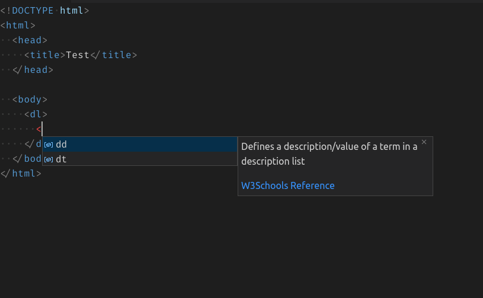

[](https://travis-ci.com/SimonSiefke/vscode-html-language-features) [](https://marketplace.visualstudio.com/items?itemName=SimonSiefke.html-language-features) [](https://renovatebot.com/)

# HTML Language Features for VSCode



<!-- Features:
- Html intellisense
 -->

<!-- TODO better image -->

Note: for this to work, you need to disable:

- the built in `html-language-features` extension
- the built in `emmet` extension

<!-- TODO:

- snippets-->

## Commands

| Command                       | Keybinding |
| ----------------------------- | ---------- |
| Html: Wrap selection with tag | `alt+w`    |

## Settings

You can specify custom data inside your vscode settings. Make sure to specify `categories` for custom tags, otherwise they won't show up.

```json
{
  "html.customData": {
    "tags": {
      "my-button": {
        "description": "Custom button element",
        "categories": ["flow content", "phrasing content", "palpable content"]
      }
    }
  }
}
```

<!-- TODO:  [html] Automatically delete HTML closing tag when converting to self-closing tag #58315  -->

<!-- TODO


 -->

## Credits

This project is based on [vscode-html-language-service](https://github.com/microsoft/vscode-html-languageservice) and [vscode-html-language-features](https://github.com/microsoft/vscode/tree/master/extensions/html-language-features)
The descriptions for tags and attributes are taken from [MDN](https://developer.mozilla.org/en-US/docs/Web/HTML/Element) and [Whatwg](https://html.spec.whatwg.org/multipage/indices.html#elements-3)
